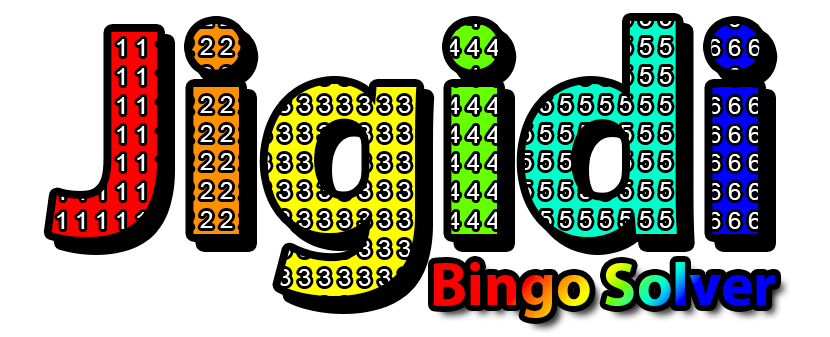
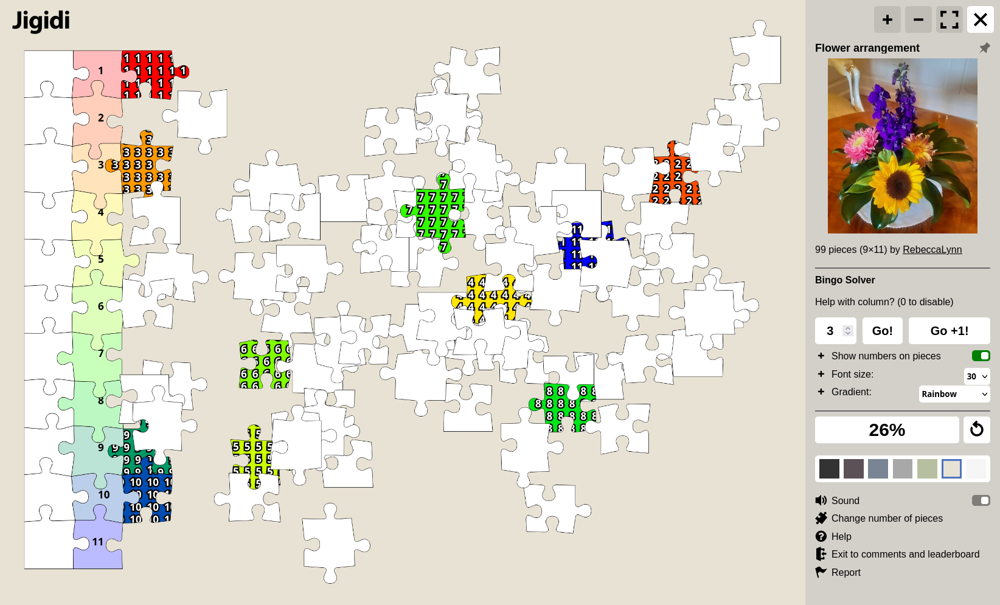

<h1 align="center">
  
   
  Jigidi Bingo Solver
</h1>

<h4 align="center">An open source userscript, to help aid in solving <a href="https://www.jigidi.com">Jigidi</a> puzzles, using easy to navigate gradient grids and numbered pieces.</h4>

 

  <!--License-->
  
  <!--Contributions-->
  
  <!--Stars-->
  
  <!--Donate-->
  

  <a href="#installation">Installation</a> •
  <a href="#how-to-use">How To Use</a> •
  <a href="#faq">Frequently Asked Questions</a> •
  <a href="#acknowledgements">Acknowledgements</a> •
  <a href="#license">License</a>

<!-- 

  

 -->

## Installation
* Create a new user account at [Jigidi](https://www.jigidi.com/join.php).
* Go to your [settings](https://www.jigidi.com/profile.php) and enable [Zen Mode](https://www.jigidi.com/a/zen-mode/).
* Install a userscript manager such as [Tampermonkey](https://www.tampermonkey.net/) or [Violentmonkey](https://violentmonkey.github.io/).
* Add the userscript by clicking [here]() (GitHub repo) or [here]() (Greasy Fork).

## How To Use
1. Open any Jigidi puzzle in your browser.
2. The script will automatically load the settings panel, and start you off with coloring the first column.
3. Solve each column manually.
4. Click the button "Go +1!" to move to the next column.
5. Repeat step 3 and 4 until you have solved all the columns.

## FAQ
- #### Q: Will this automatically solve the puzzles for me?
  - No, this is not an automated script. You will need to manually solve each column, one at a time.
  - This script is designed to be "a helping hand", rather than a fully automated solution.
- #### Q: What's the difference between "Go!" and "Go +1!"?
  - "Go!" will allow you to move to a specific column, which can be set in the input box.
  - "Go +1!" will automatically move to the next column. This is the button you will be using most of the time.
- #### Q: What are the different gradients, and how can I add more?
  - There are currently 7 different gradients.
    - Rainbow: A colorful gradient of the 4 main colors of the rainbow; red, yellow, green, and blue.
    - Distinct: 7 different colors, that are calculated to be the most distinct from each other. (Thanks to @rambii and his useful [website](https://mokole.com/palette.html)!)
    - Rastafari: A gradient of the Rastafari rainbow; red, yellow, and green.
    - Sublime Vivid: Pink, purple, and blue vivid colors.
    - DanQ: An homage to [the original author](https://danq.me), who originally used this gradient in his script.
    - Instagram: A gradient of the Instagram colors.
    - Hacker: RGB with contrasting black in between.
  - You can add custom gradients yourself, by defining them in the `gradientsArray` object in the script. Please be advised that these gradients will be overwritten when the script is updated.
  - If you have found some good gradients, and would like to have them permanently added, please [contact me](https://github.com/f-o/Jigidi-Bingo-Solver/issues/new) for more information.
- #### Q: The numbers are really big/small, and I can't read them?
  - You can manually adjust the font size in the settings panel.
  - Alternatively you can turn them off completely, if you prefer to solve the puzzles without numbers.
- #### Q: Will my account be banned for using this userscript?
  - While I have not heard about any instances of users being banned for using this userscript, it is still recommended to create a new account.
  - This script comes with no warranty, and you are responsible for any actions taken as a result of using this userscript.
- #### Q: What is "Zen Mode", and why does it need to be enabled?
  - Zen Mode is a feature that completely disables the built-in clock timer in Jigidi.
  - It is recommended to enable Zen Mode when using this userscript, as it will prevent your time from being displayed on the leaderboards. Many users take great pride in solving these puzzles organically, and it's only fair we respect them by not trumping their scores with advantage scripts.
- #### Q: Can I use this on other websites?
  - No, this userscript is not designed to be used on other websites. It is meant to be used on <a href="https://www.jigidi.com">Jigidi</a> puzzles.
- #### Q: Why is it called "Bingo Solver"? What does bingo have to do with it?
  - The name "Bingo Solver" was chosen, because the puzzle pieces sorta resembles [bingo balls](https://i.ibb.co/qgX8yCK/IMG-6818-730x730.jpg) with their colorful hues and repeating numbers.
  - It is just a silly name I came up with, and does not have any real meaning.

## Acknowledgements
This script would not have been possible without the fantastic mind of [Dan Q](https://github.com/dan-q). 
He has created a multitude of Jigidi scripts, constantly trying to perfect the art of solving puzzles (for coordinates 😉). 
You can still find [his original script](https://gist.github.com/Dan-Q/b5e4dbb45851b07042b6a57ebe1005a7), as well as [his other "Jigidi Helper" script](https://github.com/dan-q/Jigidi-Bingo-Solver). 
Be sure to also check out his [YouTube channel](https://www.youtube.com/@danq) where you can watch some of his scripts in action!

Also a big shout-out to everyones favourite LLM - ChatGPT, who has helped me immensely with this script. I'm not really a JS expert, but I was able to get this script to work with ChatGPT.

Gradients are sourced from [uiGradients](https://uigradients.com/), [PaletteMaker.com](https://palettemaker.com/), and [MOKOLÉ.com](https://mokole.com/palette.html).

## License
[MIT License](https://github.com/f-o/Jigidi-Bingo-Solver/blob/master/LICENSE)

## Support
This project is free and open source. 
If you find it useful, please consider supporting the project by donating.
  

